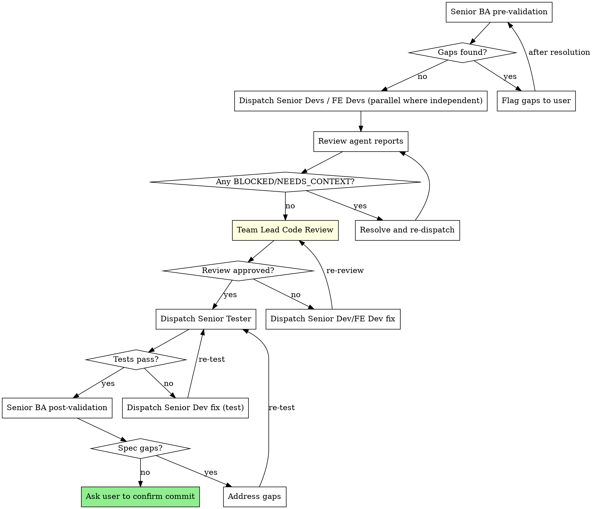

# Team-Based Plan Execution

Execute a plan using a structured agent team: Team Lead (you), Senior Dev, Senior FE Dev, Tester, and BA. The Team Lead is the main agent — you orchestrate, review code directly, and make quality decisions. Senior Dev, Senior FE Dev, Tester, and BA are dispatched subagents with specialized mandates. Senior Dev handles backend tasks; Senior FE Dev handles frontend tasks (Vue components, pages, stores, API layer).

**When to use over `proceed` or `subagent-driven-development`:** When the plan is large (5+ tasks), has a spec document, touches multiple system layers, or when you want pre-implementation requirements validation and post-implementation spec verification — not just code review.

**Input:** Plan name (e.g., `2026-03-22-01-script-transform-data`). Passed as ARGUMENTS.

## Step 1: Find and Analyze the Plan

- Search `docs/plans/` and `docs/executing/` for the plan
- If in `docs/plans/`, move to `docs/executing/` before starting
- Read the plan fully — extract:
  - **Chunks** (numbered sections)
  - **Tasks** within each chunk (with full text, steps, code, verification commands)
  - **Dependencies** between tasks (which can run in parallel vs sequential)
  - **Commit points** (where the plan says to commit)
  - **Spec file** (if referenced in the plan header)
- Check `git log --oneline -15` and `git diff --stat` for prior progress
- Create TodoWrite with one todo per task

## Step 2: Present Status and Confirm

Report:
- **Plan:** [name]
- **Spec:** [spec file path, or "none"]
- **Chunks:** [count] with [total task count] tasks
- **Dependency map:** Which tasks are independent, which are sequential
- **Commit points:** [list]

Ask the user to confirm before starting.

## Step 3: Execute Chunk by Chunk

For each chunk, follow this cycle:

### 3a: Senior BA Pre-Validation

Dispatch a Senior BA agent **before** implementation begins for the chunk. Skip this step if no spec file exists.

Use the prompt template in `./ba-prompt.md`, filling in:
- `[CHUNK_NUMBER]` — the chunk being validated
- `[TASK_RANGE]` — e.g., "Tasks 1-4"
- `[SPEC_PATH]` — path to the spec document
- `[PLAN_PATH]` — path to the plan in `docs/executing/`

If the BA reports gaps, flag them to the user before proceeding.

### 3b: Dispatch Senior Devs / Senior FE Devs

For each independent task in the chunk, dispatch the appropriate agent:
- **Backend tasks** (API routes, services, DB, MCP tools, migrations) → Senior Dev using `./senior-dev-prompt.md`
- **Frontend tasks** (Vue components, pages, stores, API layer, styles) → Senior FE Dev using `./senior-fe-dev-prompt.md`
- **Full-stack tasks** — split into backend-first and frontend-follow-up if possible; otherwise dispatch a Senior Dev with frontend context included

**Parallel dispatch rules:**
- Tasks that don't share files and don't depend on each other's output: dispatch in parallel
- Tasks that modify the same files or depend on prior task output: dispatch sequentially
- Use `isolation: "worktree"` when parallel agents touch different packages
- Backend and frontend tasks in the same chunk can often run in parallel (different packages)

**Fill in the template with:**
- `[TASK_NUMBER]` and `[TASK_NAME]`
- `[FULL_TASK_TEXT]` — the complete task from the plan (all steps, code snippets, verification commands). **Never** make agents read the plan file.
- `[CONTEXT]` — what's already been implemented, dependencies, architectural notes
- `[WORKING_DIRECTORY]` — the project root

**Handle agent status:**
- **DONE**: Proceed to Senior Tester
- **DONE_WITH_CONCERNS**: Evaluate concerns; fix if about correctness
- **NEEDS_CONTEXT**: Provide context and re-dispatch
- **BLOCKED**: Assess — provide context, try more capable model, split task, or escalate to user

### 3c: Team Lead Code Review

After all Senior Devs / Senior FE Devs report DONE, **you (the Team Lead) review the code directly** — do not dispatch a subagent for this.

**Review process:**
1. Read every file changed by the Senior Dev agents (use their "Files changed" reports)
2. Evaluate against this checklist:

**Correctness:**
- Does the implementation match what the task specified?
- Are edge cases handled?
- Are there logic errors or off-by-one mistakes?

**Quality:**
- Does the code follow existing patterns in the codebase?
- Are names clear and consistent with surrounding code?
- Is it minimal — no over-engineering, no unnecessary abstractions?

**Integration:**
- Will this break other parts of the system? (Check CLAUDE.md warnings, especially reports/dashboards shared infrastructure)
- Are shared types updated correctly in `@lighthouse/shared`?
- Are imports and dependencies correct?

**Security:**
- No user-database writes (read-only by design)
- No injection vectors, no exposed secrets

**Report to user:**
- List each file reviewed with a one-line verdict (approved / needs change)
- If changes needed: describe the issue, dispatch the appropriate Senior Dev/FE Dev to fix, then re-review
- If approved: proceed to Tester

**Escalation:** If a fix fails review twice, escalate to the user.

### 3d: Dispatch Senior Tester

After the Team Lead approves the code, dispatch a Senior Tester agent using `./tester-prompt.md`.

**Fill in:**
- `[VERIFICATION_COMMANDS]` — all verification commands from the completed tasks
- `[WORKING_DIRECTORY]` — the project root

If any test fails, dispatch the appropriate Senior Dev/FE Dev to fix, then re-run the Team Lead review (3c), then re-test.

### 3e: Senior BA Post-Validation

After tests pass, dispatch the Senior BA again for post-chunk validation. Skip if no spec file.

Use the post-chunk section of `./ba-prompt.md`, filling in:
- `[CHUNK_NUMBER]`
- `[FILES_CHANGED]` — list of files created/modified in this chunk
- `[SPEC_PATH]`

If gaps found, address them, re-test, re-validate.

### 3f: Commit Point

If the plan specifies a commit at this point, ask the user to confirm.
**Never auto-commit.** Present the commit message from the plan and wait for approval.

## Step 4: Completion

When all chunks are done:
1. Dispatch a final Senior Tester for full-project verification (build, typecheck, all tests)
2. Move plan from `docs/executing/` to `docs/completions/` (create folder if needed)
3. Report final status summary to the user

## Important Rules

- **Never skip verification.** Every task has a verification step. Evidence before assertions.
- **Never skip code review.** The Team Lead must review every file changed before dispatching the Tester. No code reaches testing without Team Lead approval.
- **Never auto-commit.** Ask the user before each commit point.
- **Never modify the plan without asking.** Flag changes to the user first.
- **Paste full task text** into every agent dispatch. Agents must not read the plan file.
- **Track progress** with TodoWrite — one todo per task, update status as work proceeds.
- **Escalate after 2 failures.** If a task fails review twice, escalate to the user.

## Supporting Files

- `./senior-dev-prompt.md` — Prompt template for Senior Dev (backend) implementer agents
- `./senior-fe-dev-prompt.md` — Prompt template for Senior FE Dev (frontend) implementer agents
- `./tester-prompt.md` — Prompt template for Senior Tester verification agents
- `./ba-prompt.md` — Prompt template for Senior BA validation agents (pre and post-chunk)
